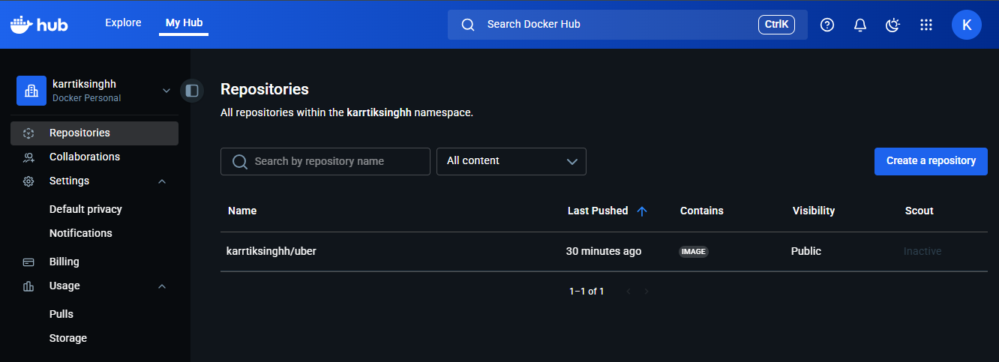
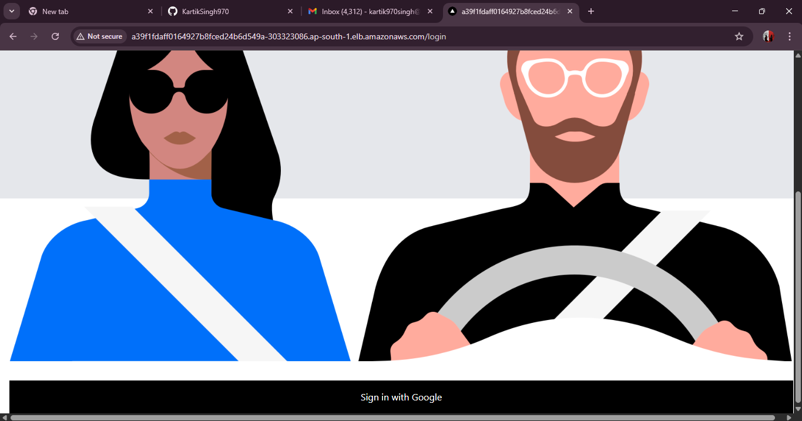
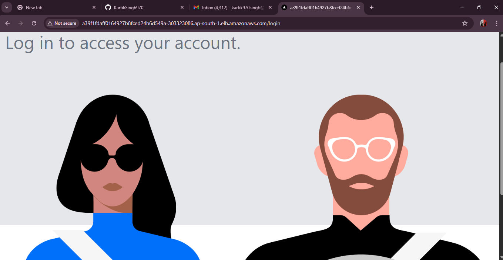
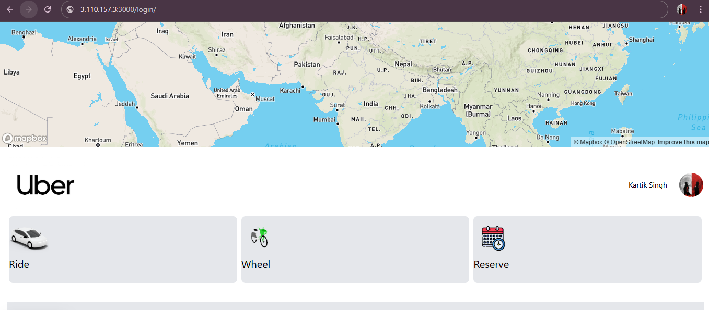
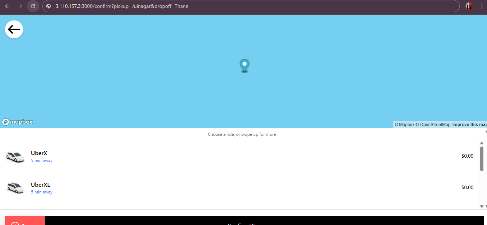

# 🚖 **Implementing a DevSecOps CI/CD Pipeline for an Uber Clone**

A complete **DevSecOps pipeline implementation** for a sample **Uber Clone** web application.  
This project integrates **CI/CD**, **security**, **containerization**, and **Kubernetes deployment** — simulating a real-world production workflow.

---

## 🧱 Project Overview

The **Uber Clone** app is a web-based simulation of Uber’s ride-booking system.  
The goal was to design and automate the full lifecycle — from **code commit → security scan → build → image scanning → deployment → verification**.

---

## ⚙️ Tech Stack & Tools Used

| Area | Tools |
|------|-------|
| Source Control | **GitHub** |
| CI/CD | **Jenkins** |
| Containerization | **Docker** |
| Image Registry | **Docker Hub** |
| Code Quality & Security | **SonarQube**, **OWASP ZAP**, **Trivy** |
| Orchestration | **Kubernetes** |
| Infrastructure | **AWS EKS Cluster** |

---

## 🔒 DevSecOps Pipeline Overview

The pipeline ensures **continuous integration**, **continuous delivery**, and **continuous security**, enabling early detection of vulnerabilities and seamless deployment.

### 🧩 Stages:
1. **Code Commit** → Source pushed to GitHub  
2. **Build Stage** → Jenkins builds Docker image  
3. **Static Code Analysis** → SonarQube scans for code quality issues  
4. **Container Image Scanning** → Trivy checks Docker image for vulnerabilities  
5. **Dynamic Application Security Testing** → OWASP ZAP scans for runtime vulnerabilities  
6. **Image Push** → Securely push the verified image to DockerHub  
7. **Deployment** → Deploy image to **AWS EKS Cluster** using Kubernetes manifests  
8. **Verification** → Access app and validate deployment output

---

## 📸 Visual Pipeline Flow

---

## ☸️ Kubernetes Cluster Setup

The deployment was successfully executed on an **AWS EKS Cluster**, ensuring scalability, fault tolerance, and managed Kubernetes control plane.

---

## 🚀 Deployment Output

---

## 🗺️ Application UI

### Map View

### Pickup & Drop Selection

### Ride List

---

## 🧠 Summary

This project demonstrates the implementation of a **robust DevSecOps CI/CD pipeline** for an Uber Clone application using modern cloud-native practices.  
Key highlights include:

- Automated **build → scan → deploy** workflow with Jenkins  
- Integrated **SonarQube** for code analysis  
- **Trivy** for Docker image vulnerability scanning  
- **OWASP ZAP** for dynamic web application testing  
- Continuous deployment to **AWS EKS Cluster** for scalability  
- End-to-end DevSecOps alignment ensuring **speed, reliability, and security**

---

## 🧑‍💻 Author

**Kartik Singh**  
DevOps & Cloud Enthusiast | Passionate about automation, scalability & security  

📍 [GitHub Profile](https://github.com/KartikSingh970)

---

⭐ If you like this project, don’t forget to **star** the repository!
